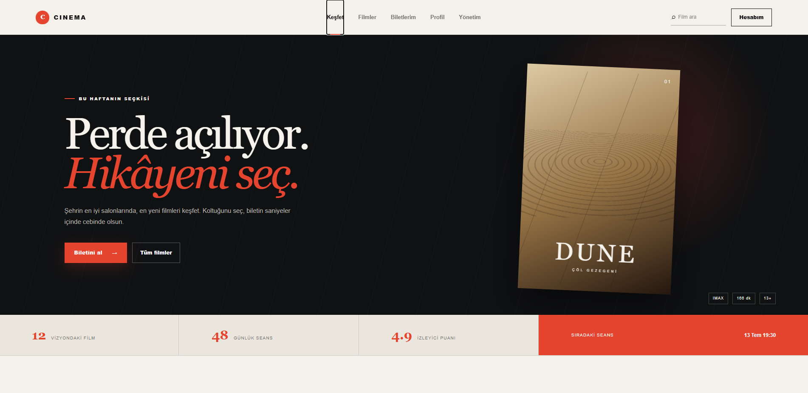
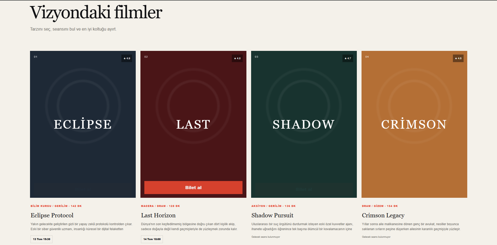
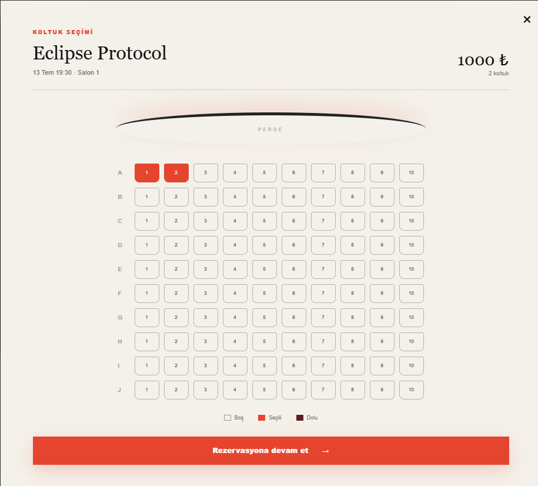
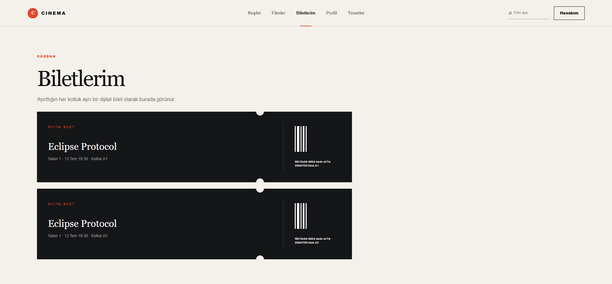
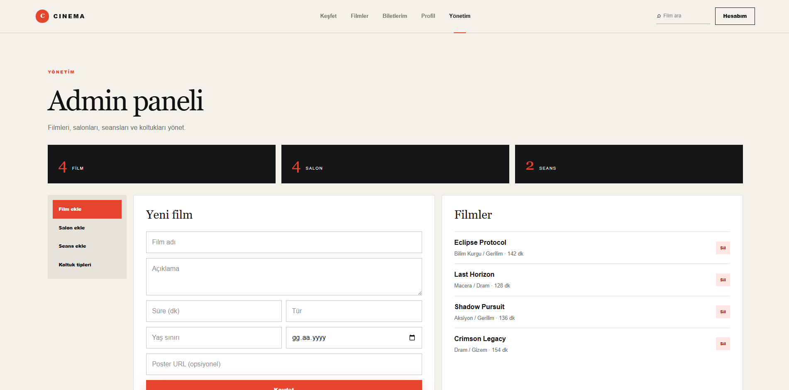
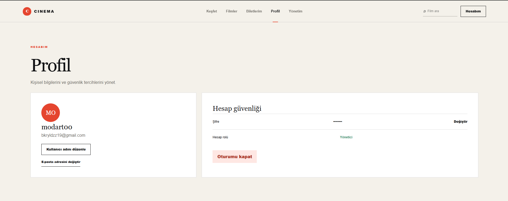
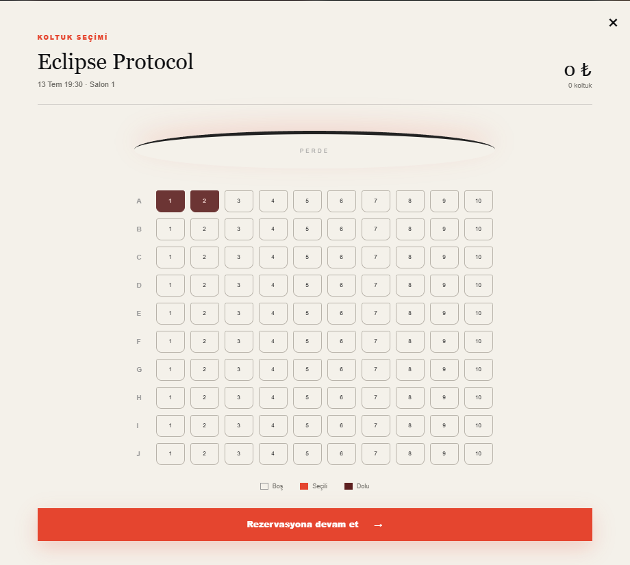
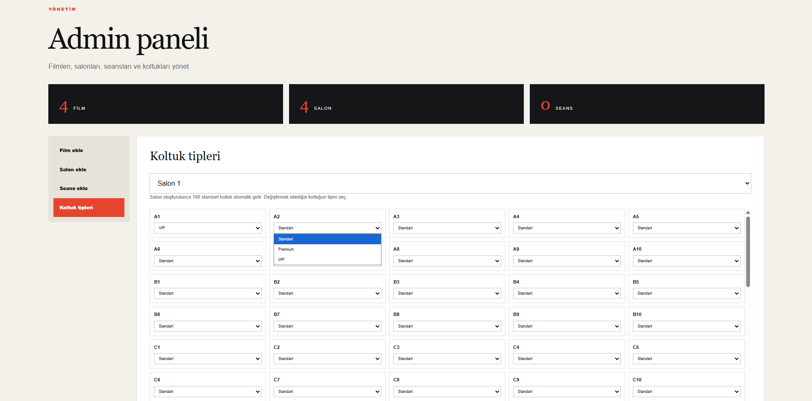
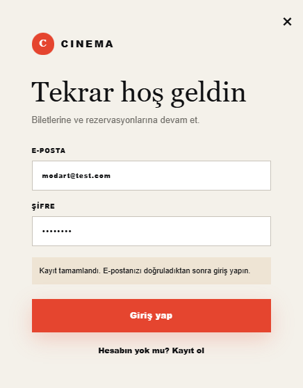

# Cinema Reservation System

A full-stack cinema reservation platform built with Spring Boot, MySQL, Redis, Docker, and a Vinext-based frontend.

The application includes secure authentication, email verification, role-based authorization, movie and screening management, seat selection, reservation handling, payment simulation, and digital ticket generation.

---

## Features

### Authentication and Security

- User registration and login
- JWT-based authentication
- Refresh token support
- Email account verification
- Role-based authorization
- Admin and user access control
- BCrypt password hashing

### Cinema Management

- Movie management
- Cinema hall management
- Screening management
- Seat management
- Different seat types
- Pagination support

### Reservation and Ticketing

- Seat availability tracking
- Reservation creation and cancellation
- Reservation expiration handling
- Payment simulation
- Digital ticket generation
- User-specific ticket and reservation history

### Infrastructure

- MySQL database
- Redis integration
- Docker Compose environment
- Structured logging with SLF4J
- Global exception handling
- Validation
- Unit tests with JUnit and Mockito

---

## Tech Stack

### Backend

- Java
- Spring Boot
- Spring Security
- Spring Data JPA
- Hibernate
- MySQL
- Redis
- JJWT
- Java Mail Sender
- Maven
- Lombok
- JUnit
- Mockito

### Frontend

- TypeScript
- React
- Next.js
- Vinext
- Vite
- Tailwind CSS
- Nginx

### DevOps

- Docker
- Docker Compose

---

## Project Architecture

```text
Client
  |
  v
Frontend Application
  |
  v
Spring Boot REST API
  |
  +-- Security Layer
  |     +-- JWT Authentication Filter
  |     +-- Role-Based Authorization
  |
  +-- Controller Layer
  |
  +-- Service Layer
  |
  +-- Repository Layer
  |
  +-- MySQL
  |
  +-- Redis

The backend follows a layered architecture:

Controller
   |
   v
Service
   |
   v
Repository
   |
   v
Database

Request and response DTOs are used to avoid exposing entity objects directly through the API.

Main Domain Model

The system contains the following primary entities:

User
Movie
Hall
Seat
Screening
Reservation
ReservationSeat
Payment
Ticket
VerificationToken

Main reservation flow:

Movie
  |
  v
Screening
  |
  v
Seat Selection
  |
  v
Reservation
  |
  v
Payment
  |
  v
Ticket
Authentication Flow
Register
  |
  v
Verification email sent
  |
  v
User verifies account
  |
  v
Login
  |
  v
Access Token + Refresh Token

Protected requests use the following header:

Authorization: Bearer <access-token>
```

Running the Project with Docker
1. Clone the repository
git clone https://github.com/Modart00/cinema-reservation-system.git
cd cinema-reservation-system
2. Create an .env file

Create a file named .env in the root directory:

DB_PASSWORD=your_database_password

JWT_SECRET=your_base64_jwt_secret

MAIL_USERNAME=your_email_address
MAIL_PASSWORD=your_email_app_password

The .env file is ignored by Git and must not be committed.

3. Start the containers
docker compose up --build

The services will be available at:

Frontend: http://localhost:3000
Backend:  http://localhost:8080
MySQL:    localhost:3307
Redis:    localhost:6379

To stop the application:

docker compose down

To stop the application and remove database volumes:

docker compose down -v
Running the Backend Locally

Make sure MySQL is running and the required environment variables are configured.

Then run:

./mvnw spring-boot:run

On Windows:

.\mvnw.cmd spring-boot:run
Running the Frontend Locally
cd frontend
npm install
npm run dev

The frontend will run on:

http://localhost:3000
Testing

Run all backend tests:

./mvnw test

On Windows:

.\mvnw.cmd test

The project contains tests for service, security, controller, and exception handling layers using JUnit and Mockito.

Environment Variables
Variable	            Description
DB_PASSWORD	          MySQL root password
JWT_SECRET	          Base64-encoded JWT signing key
MAIL_USERNAME	        Email account used for verification emails
MAIL_PASSWORD	        Email application password

Security Notes
Passwords are stored using BCrypt.
JWT access tokens are short-lived.
Refresh tokens are used to obtain new access tokens.
Admin endpoints require the ROLE_ADMIN authority.
Sensitive configuration values are loaded from environment variables.
The .env file is excluded from version control.
Future Improvements
Swagger / OpenAPI documentation
GitHub Actions CI pipeline
Production deployment with Nginx and SSL
Real payment provider integration
QR code ticket verification
Database migrations with Flyway
Integration and end-to-end tests
Author

Bekir Yıldız

GitHub: @Modart00

## Main Page



## Movies



## Seat Selection



## Tickets



## Admin Panel



## Profile



## Reservation


## Reserved Seats



## Seat Types



## Login


